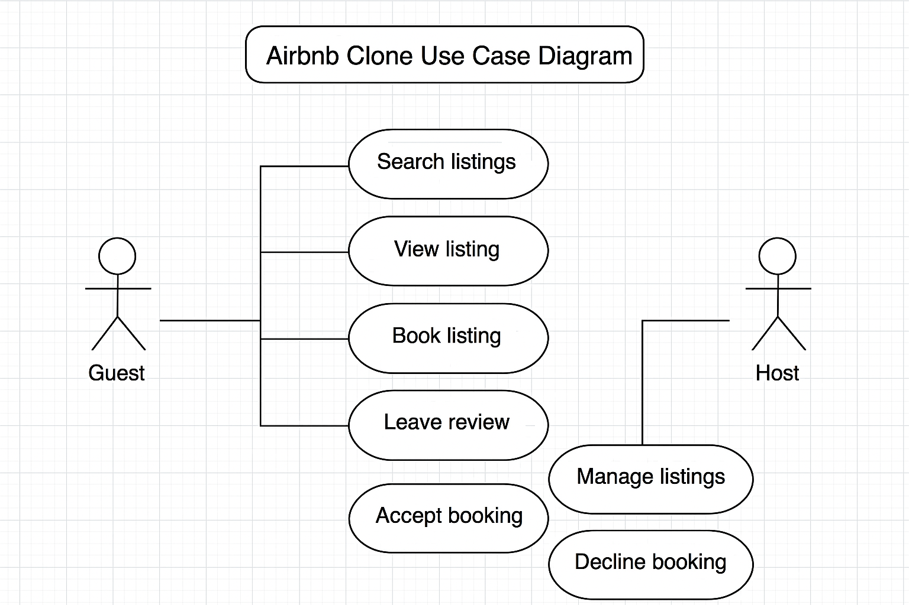

# 📘 Requirement Analysis in Software Development

This repository is where I’m documenting everything I’m learning about **Requirement Analysis** as part of my software development journey. Requirement analysis is a critical early step in building any software system, and this repo helps me understand how to do it right—from gathering information to validating what users actually need.

---

## 🧭 Introduction

I created this repository to keep track of what I’ve learned about requirement analysis and to apply it to real scenarios. It includes explanations, notes, and examples based on a case study involving a **booking management project**. The goal is to understand how to capture and define clear, useful software requirements before jumping into design or coding.

---

## ❓ What is Requirement Analysis?

Requirement Analysis is the process of figuring out **what a system is supposed to do** and making sure that understanding is shared between users, developers, and stakeholders. 

It’s basically about asking the right questions, listening carefully, and writing things down in a way that makes sense. This process helps avoid confusion later and makes sure that the final software actually solves the problem it was meant to.

In the software development lifecycle (SDLC), requirement analysis comes early—right after the idea for a project is proposed. If this step isn’t done well, the rest of the project can go off track pretty quickly.

---

## 🚀 Why is Requirement Analysis Important?

Here are a few reasons I’ve found that explain why this step really matters:

1. **Everyone Gets on the Same Page**  
   It helps developers, clients, and project managers understand the goals and features of the system before writing any code.

2. **Prevents Costly Mistakes**  
   It’s easier and cheaper to fix problems in the planning stage than after development has started.

3. **Guides the Whole Project**  
   Clear requirements give direction for design, coding, testing, and even maintenance. Without them, it’s like building a house without a blueprint.

---

## ⚙️ Key Activities in Requirement Analysis

Here are the five main activities I’m learning to do during requirement analysis:

### 1. Requirement Gathering  
This is when I talk to stakeholders (users, clients, etc.) and collect their ideas, needs, and expectations for the system.

### 2. Requirement Elicitation  
This goes deeper than gathering—it’s about asking the right questions and using techniques like interviews, workshops, and observations to draw out important details.

### 3. Requirement Documentation  
I take everything I’ve learned and write it down clearly, usually in formats like user stories, Software Requirements Specifications (SRS), or use case diagrams.

### 4. Requirement Analysis and Modeling  
This involves organizing the information, finding gaps or conflicts, and modeling how the system should behave. Tools like flowcharts or ER diagrams are helpful here.

### 5. Requirement Validation  
Finally, I check with stakeholders to make sure I got it right. This step helps confirm that the documented requirements are complete and aligned with what they need.

---

## 🧱 Types of Requirements

Here’s what I learned about the two main categories of requirements, with examples based on a **booking management project** I’m using as a case study.

### 🔹 Functional Requirements

These describe **what the system should do**—its main features and functions.

**Examples:**
- Users can make, edit, and cancel bookings.
- The system should send confirmation emails after each successful booking.
- Admin users can manage available booking slots.
- Users must log in to access their booking history.

### 🔸 Non-functional Requirements

These describe **how the system should perform** or behave under certain conditions.

**Examples:**
- The system must respond to user actions within 2 seconds.
- It should support up to 1,000 users making bookings at the same time.
- User data should be stored securely using encryption.
- The booking system should have 99.9% uptime over a year.

---
## 🎯 Use Case Diagrams

While working on this project, I learned that **Use Case Diagrams** are a great way to visually show how users (actors) interact with the system. They focus on the system’s **functionality** from an external point of view.

---

### 📌 What Are Use Case Diagrams?

Use Case Diagrams are a part of UML (Unified Modeling Language). They help:
- Identify the main **actors** (users or external systems).
- Define the different **use cases** (what users can do).
- Clarify how users interact with the system.

This helps both technical and non-technical stakeholders quickly understand the system’s scope and key features.

---

### 👥 Actors in Our Booking System
- **User** – can register, log in, book, pay, cancel, and view history.
- **Admin** – manages slots and all bookings.
- **Payment System** – external system that handles transactions.

---

### 🧩 Use Case Diagram

Here’s the use case diagram I created for this Booking Management System:

> Filename: `alx-booking-uc.png`

---

## ✅ Acceptance Criteria

Below are the acceptance criteria I wrote for each key feature in the Booking Management System. These help define when each feature is considered complete and working as expected.

---

### 🧾 1. User Registration

**Feature:** Allow users to create an account.

**Acceptance Criteria:**
- [ ] The registration form must include fields for full name, email, password, and phone number.
- [ ] The system must validate all fields before submission (e.g., email format, password length).
- [ ] The system must check for duplicate emails before creating the account.
- [ ] Upon successful registration, the user should receive a welcome email.
- [ ] The user should be redirected to the login page after successful registration.

---

### 🔐 2. User Login & Authentication

**Feature:** Allow users to log in securely.

**Acceptance Criteria:**
- [ ] Users must enter a valid email and password to log in.
- [ ] The system must return an error message if credentials are incorrect.
- [ ] After logging in, users are redirected to their dashboard.
- [ ] Users stay logged in during their session unless they log out manually.

---

### 📅 3. View Available Booking Slots

**Feature:** Display available time slots for booking.

**Acceptance Criteria:**
- [ ] The system must show a list or calendar of available dates and times.
- [ ] The list must be updated in real-time to prevent double bookings.
- [ ] The user must be able to filter available slots by service type or provider (if applicable).

---

### 📝 4. Create a Booking

**Feature:** Allow users to make a booking.

**Acceptance Criteria:**
- [ ] Only logged-in users can make a booking.
- [ ] The user must select a service, date, and time from available options.
- [ ] The system must prevent double booking of the same slot.
- [ ] A booking summary must be shown before confirmation.
- [ ] The booking is stored in the database upon confirmation.

---

### ✏️ 5. Edit or Cancel a Booking

**Feature:** Let users change or cancel their existing bookings.

**Acceptance Criteria:**
- [ ] Users must be logged in to view their bookings.
- [ ] Users can reschedule or cancel a booking if it hasn’t passed yet.
- [ ] The system must update the availability list accordingly.
- [ ] The user must receive an email confirming the update or cancellation.

---

### 💳 6. Checkout and Payment

**Feature:** Handle payment at the time of booking.

**Acceptance Criteria:**
- [ ] The checkout page must show a detailed summary of the booking.
- [ ] The user must enter valid payment information.
- [ ] The system must validate and process the payment securely.
- [ ] On success:
  - Save the booking to the database.
  - Send a payment receipt and booking confirmation via email.
  - Redirect the user to a confirmation page.
- [ ] On failure:
  - Show an error message.
  - Allow the user to retry with different payment info.

---

### 📬 7. Email Notifications

**Feature:** Send confirmation and status update emails.

**Acceptance Criteria:**
- [ ] Send an email upon successful registration.
- [ ] Send a booking confirmation email after checkout.
- [ ] Send a notification email when a booking is edited or canceled.
- [ ] Emails must include all relevant booking details.

---

### 🧑‍💼 8. Admin: Manage Booking Slots

**Feature:** Admins can create, edit, and delete available booking slots.

**Acceptance Criteria:**
- [ ] Admins must log in with valid credentials.
- [ ] Admins can add new slots (date, time, and service).
- [ ] Admins can remove or edit existing slots.
- [ ] Changes to slot availability must reflect in the user interface instantly.

---

### 📊 9. Admin: View All Bookings

**Feature:** Admins can view and manage all user bookings.

**Acceptance Criteria:**
- [ ] Admins can see a list of all bookings with filters (e.g., date, service, user).
- [ ] Admins can cancel or modify any booking if necessary.
- [ ] Admin actions must trigger user notifications via email.

---

